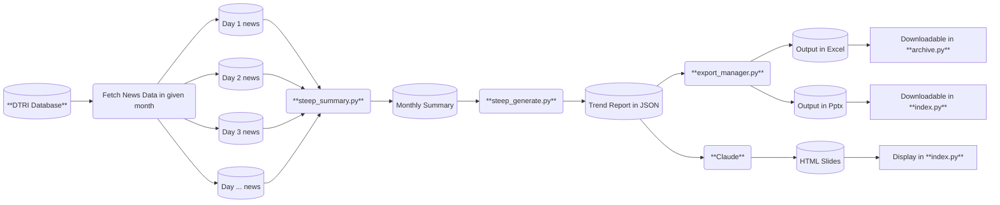
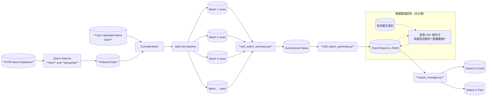
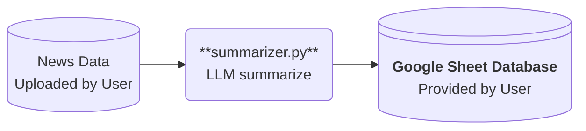

# Demand Foresight Trend Report Generator
## Tool Explanation by Flowchart
> Steep 月報產生器


> 特定主題報告產生器


> 新聞摘要產生器



## Web Service (Cloud)
Deployed on Streamlit Cloud Platform.
> Link to **[this page](https://demand-foresight-trend-report-generator-main.streamlit.app/)**

## Build Setup (Local)
Clone the repository by the following command:
```
git clone https://github.com/taaqat/demand-foresight-trend-report-generator.git
```

Then install required packages:
```
pip install -r requirements.txt
```

Then configure your `.streamlit` folder
- `.streamlit/config.toml`
    You can change the theme setting in this file. The following is the example usage. You can modify at will. For details, please refer to [this link](https://docs.streamlit.io/develop/api-reference/configuration/config.toml).
    ```
    [theme]
    primaryColor="#baad8d"
    backgroundColor="#FFFFFF"
    secondaryBackgroundColor="#ebebeb"
    textColor="#31333F"
    font="sans serif"

    [client]
    showErrorDetails = "full"
    toolbarMode = "auto"
    showSidebarNavigation = false
    ```
- `.streamlit/secrets.toml`
    This file is used to store your credentials, including LLM api keys and google service account credential. Please configure as follows:
    ```
    CLAUDE_KEY = ""
    OPENAI_KEY = ""
    III_KEY = "Please request the III key from admin (鴻壹)"

    [connections.gsheets]
    spreadsheet = "https://docs.google.com/spreadsheets/d/1r2dfV1ubKywv5RjcLCB6wTfa25O9_s1kSm8grvw7p9w/edit?gid=0#gid=0"

    type = "service_account"
    project_id =  "YOUR_PROJECT_ID"
    private_key_id = "YOUR_PRIVATE_KEY_ID"
    private_key = "YOUR_PRIVATE_KEY"
    client_email = "YOUR_CLIENT_EMAIL"
    client_id = "YOUR_CLIENT_ID"
    auth_uri = "https://accounts.google.com/o/oauth2/auth"
    token_uri = "https://oauth2.googleapis.com/token"
    auth_provider_x509_cert_url = "https://www.googleapis.com/oauth2/v1/certs"
    client_x509_cert_url = "YOUR_CERT_URL"
    universe_domain = "googleapis.com"

    [connections.gsheets2]
    spreadsheet = "https://docs.google.com/spreadsheets/d/1XjqihYMdblq6DZxP4_f6U3mWnGMcUxfhVXfhfMys4-Q/edit?gid=0#gid=0"
    type = "service_account"
    project_id =  "YOUR_PROJECT_ID"
    private_key_id = "YOUR_PRIVATE_KEY_ID"
    private_key = "YOUR_PRIVATE_KEY"
    client_email = "YOUR_CLIENT_EMAIL"
    client_id = "YOUR_CLIENT_ID"
    auth_uri = "https://accounts.google.com/o/oauth2/auth"
    token_uri = "https://oauth2.googleapis.com/token"
    auth_provider_x509_cert_url = "https://www.googleapis.com/oauth2/v1/certs"
    client_x509_cert_url = "YOUR_CERT_URL"
    universe_domain = "googleapis.com"


    [connections.gsauth]
    spreadsheet = "https://docs.google.com/spreadsheets/d/1eUn0aOFSnHh3oOLEExeD5lr306RNqNQdpterkPbEXWY/edit?gid=0#gid=0"
    type = "service_account"
    project_id =  "YOUR_PROJECT_ID"
    private_key_id = "YOUR_PRIVATE_KEY_ID"
    private_key = "YOUR_PRIVATE_KEY"
    client_email = "YOUR_CLIENT_EMAIL"
    client_id = "YOUR_CLIENT_ID"
    auth_uri = "https://accounts.google.com/o/oauth2/auth"
    token_uri = "https://oauth2.googleapis.com/token"
    auth_provider_x509_cert_url = "https://www.googleapis.com/oauth2/v1/certs"
    client_x509_cert_url = "YOUR_CERT_URL"
    universe_domain = "googleapis.com"

    [permission]
    authenticate = false
    trend_report_generator = true
    theme_based_generator = true
    gallery = true 
    chat_tool = true
    visualization = false
    user_token = false


    [gsheet-credits]
    credits = '''{
  "type": "service_account",
  "project_id": "YOUR_PROJECT_ID",
  "private_key_id": "YOUR_PRIVATE_KEY_ID",
  "private_key": "YOUR_PRIVATE_KEY",
  "client_email": "YOUR_CLIENT_EMAIL",
  "client_id": "YOUR_CLIENT_ID",
  "auth_uri": "https://accounts.google.com/o/oauth2/auth",
  "token_uri": "https://oauth2.googleapis.com/token",
  "auth_provider_x509_cert_url": "https://www.googleapis.com/oauth2/v1/certs",
  "client_x509_cert_url": "YOUR_CERT_URL",
  "universe_domain": "googleapis.com"
    }'''
    ```

Finally, execute by the following command:
```
streamlit run index.py
```

## Structures
```
/demand-foresight-trend-report-generator
├── README.md
├── index.py
├── managers
|  ├── data_manager.py
|  ├── export_manager.py
|  ├── llm_manager.py
|  ├── prompt_manager.py
|  └── session_manager.py
├── pages
|  ├── page_demo.py
|  ├── page_archive.py
|  ├── page_self_select.py
|  └── page_steep.py
├── requirements.txt
├── scripts
|  ├── executor.py
|  ├── self_select_generate.py
|  ├── self_select_summary.py
|  ├── steep_generate.py
|  └── steep_summary.py
├── pics
├── users.yaml
```

### index.py (entry point of the app)
This file serves as the application's entry point and is primarily responsible for the following three functions:

- Authentication
- Introduction
- STEEP +B Monthly Trend Report Gallery


### pages (front end, mainly composed of streamlit api)
Page files are python scripts that display UIs by streamlit, including:

#### `page_demo.py`: 
This file demonstrates how to use the tool by youtube tutorial videos.

#### `page_steep.py`: 
This file displays the UI for STEEP trend report generation. User inputs include **nickname, email, desired period, topics, and output formats**. With such information, user can obtain trend reports in desired output format within 1 hour.

The whole generation process is:

1. Summarize all news events within the specified period
2. Generate three version crude trend reports
3. Aggregate these three versions
4. Classify representative events / news back to each trend
5. Let user check the output so far, and allow user to edit the intermediate output (which becomes the input of the subsequent inference)
6. Infer each trends with well-structured template
7. Summarize and conclude
8. Export as the format required by the user (pptx, excel)
9. Post files back to III database, and record the generation history in Google Sheet database.


#### `page_self_select.py`:
This file displays the UI for SELF SELECT trend report generation. In addition to the basic user inputs, user should also name the generation session with a consice project name. 

First, user filters desired raw news data by **querying III database with keyword boolean combination**. User would be informed with the queried raw news data and then decide whether proceed or redo the query step.

Then, if user decided to proceed, the page that asks user to input options would be shown. Aside from output format, more customizable options are provided, including **desired analysis columns** and **theme color** of pptx slide.

Subsequent process of generation is basically the same with STEEP page.

#### `page_archive.py`:

This page allows user to query the generated output files by project name. The following five types of data are provided:

- Trend reports in PPTX format
- Trend reports in EXCEL format
- Trend reports in JSON format (utf-8 encoded)
- Monthly summary data in EXCEL format
- Daily summary data in JSON format (utf-8 encoded)


### managers (back end)
This folder includes five python files for specific utilities. In each file, a class that has identical name with file name is established, with several tool functions defined by static method. 

#### `data_manager.py` -> `DataManager`

This file defines functions that associate with **data manipulation**, **data transformation** and **III database API calling**.

- Functions that interact with III database:
    
    - `fetch()`: Fetch processed news data from III database by keywords and date.

    - `post_files()`: Post completed files back to III database

    - `get_files()`: Get generated files from III database

- Functions for data transformation and manipulation:

    - `return_daily_raw_str()`: Convert the daily raw data from pd.DataFrame to string

    - `find_json_object()`: Find JSON object from a string (Used with `LlmManager.llm_api_call()`)

    - `merge_dict()`: Merge two dictionaries.

    - `b64_to_dataframe()`: Transform Base64 formatted spreadsheet to pd.Dataframe

    - `get_output_download_link()`: Return a HTML-like string object (to be rendered on UI with `st.markdown()`). 

    - `get_summary_download_link()`: Return a HTML-like string object (to be rendered on UI with `st.markdown()`). 

#### `export_manager.py` -> `ExportManager`

This file defines functions that associate with **data export**. Functions that convert JSON formatted AI response to EXCEL and PPTX are defined under this class. Two principal functions, `create_excel()` and `create_pptx()` are defined under both two sub-classes, `STEEP` and `SELF_SELECT`, as these two generators have different output format.

- `get_report_excels()`: Transform the JSON formatted output into `pd.DataFrame`.

- `create_pptx()`: Return a Base64 string of pptx formatted trend report (to be used together with `DataManager.post_data()`.)

- `create_excel()`: Return a Base64 string of xlsx formatted trend report (to be used together with `DataManager.post_data()`.)

#### `llm_manager.py` -> `LlmManager`

This file manages everything associated with LLM API call. 

- `model_select()`: Expand a streamlit dialog form to ask user to select the model type to be used.

- `init_model()`: Initialize LLM client according to user-selected model type (**claude-3.5-sonnet / gpt-4o**).

- `api_key_verify()`: Verify the API key based on model type selected by the user. 

- `customize_token()`: Expand a streamlit dialog form to ask for user's own LLM API key.

- `llm_api_call()`: Call Claude API and return JSON formatted response. Parameter `chain` should be passed in as **LangChain runnable**  object that contains system prompt (which can be obtained by `LlmManager.create_prompt_chain()` function), and parameter `in_message` (user prompt in string format) should be passed in as well.

- `create_prompt_chain()`: Return a **LangChain runnable** object with system prompt (to be used in `LlmManager.llm_api_call()`). Parameter `sys_prompt` (system prompt) should be passed in.


#### `prompt_manager.py` -> `PromptManager`

This file manages all system prompts to be used. There are two subclasses, `STEEP` and `SELF_SELECT`, under which system prompts for all steps are defined.

#### `session_manager.py` -> `SessionManager`

This file manages functions associated with **st.session_state** management and **google sheet database connection, access and update**

- `steep_database()`: Fetch data from or update data to google sheet that stores all generation history of STEEP page.

- `self_select_database()`: Fetch data from or update data to google sheet that stores all generation history of SELF_SELECT page.

- `send_notification_email()`: Automatically send notification email while error occurs or while generation process is completed.

- `session_state_clear()`: Clear the session states based on the page parameter passed in.

- `fetch_IP()`: Return the IP address of deployment (for firewall setting for III database).

- `show_sessions()`: Show current streamlit sessions to help debug.
- 


### scripts (back end) 
This folders include five python scripts that control the workflow of trend report generation process.

#### `steep_summary.py`
- `monthly_summary()`: Summarize all news by **day** within specified period, and return in pd.DataFrame object with date as index, each STEEP theme as columns, and news summary as value. This function does not require raw data as parameter because it is nested by `DataManager.fetch()` function.

#### `steep_generate.py`
- `gen_trend_report_1()`: Generate trend report until news classification step. This function does not return any value. The result is stored in streamlit session.

 - `gen_trend_report_2()`: Continue to generate trend report, including the inference & conclusion part. This function return a JSON dictionary.

#### `self_select_summary.py`
- `monthly_summary()`: Summarize filtered news by **group** within specified period, and return in pd.DataFrame object with date as index and news summary as value. Due to the session issue, this function requires raw data as parameter. (We let users confirm the result of raw data query, then proceed to the summary prosedure.)

#### `self_select_generate.py`
- `gen_trend_report()`: Generate trend report and return in JSON format based on the specified summary data. 

#### `self_selct_executor.py`
This file links functions from `self_select_summary.py` and `self_select_generate.py`, serving as the interface that connects UI and back-end design (only for Self Select page). Specifically, `Executor` class has methods that receive user input, generate trend reports, export as pptx slides and excel, post the output files back to III database, update the generation history to google sheet database, send notification emails, and finally clear all related session state variables in progress. 


### pics (front end) 
This folder contains images for the **introduction** page (`index.py`), organized into six subfolders based on STEEP +B topics: **social, technological, economic, environmental, political, and business & investment**. Each subfolder holds three PNG images, displayed based on the user-selected year and month.